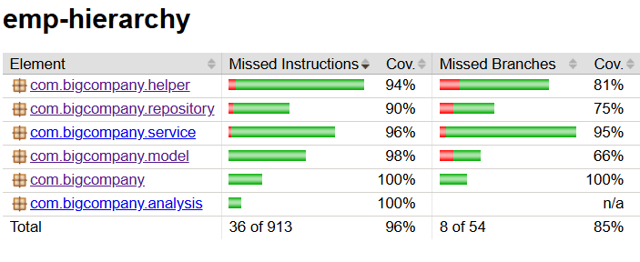
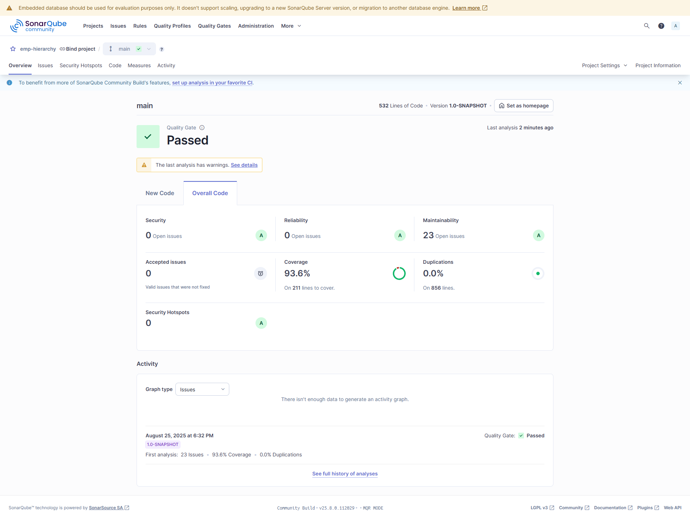

# emp-hierarchy

## Tasks
All asks mentioned in the 'Code exercise.pdf' have been completed with covering all key points. Additionally integrated with `jacoco` for code coverage report, `sonar` for code quality.

Pls go thru the below sections for additional details.

## Assumptions
1. Used Jdk 17
1. Used maven 3.9
1. Used logback with slf4j, opencsv, junit-jupiter with mockito
1. Included employees.csv file with >30 entries

## How to run
### Compile
Without sonar result

```
mvn clean install
```

With sonar result
```
mvn clean install sonar:sonar -Dsonar.host.url=http://localhost:9000 -Dsonar.projectKey=emp-hierarchy -Dsonar.token=<<API_TOKEN>>
```

### Run
```
java -jar target/emp-hierarchy-1.0-SNAPSHOT-jar-with-dependencies.jar /src/main/resources/employees.csv
```

## Coverage report


## Sonar Report
